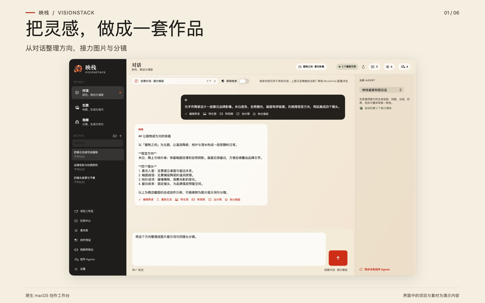
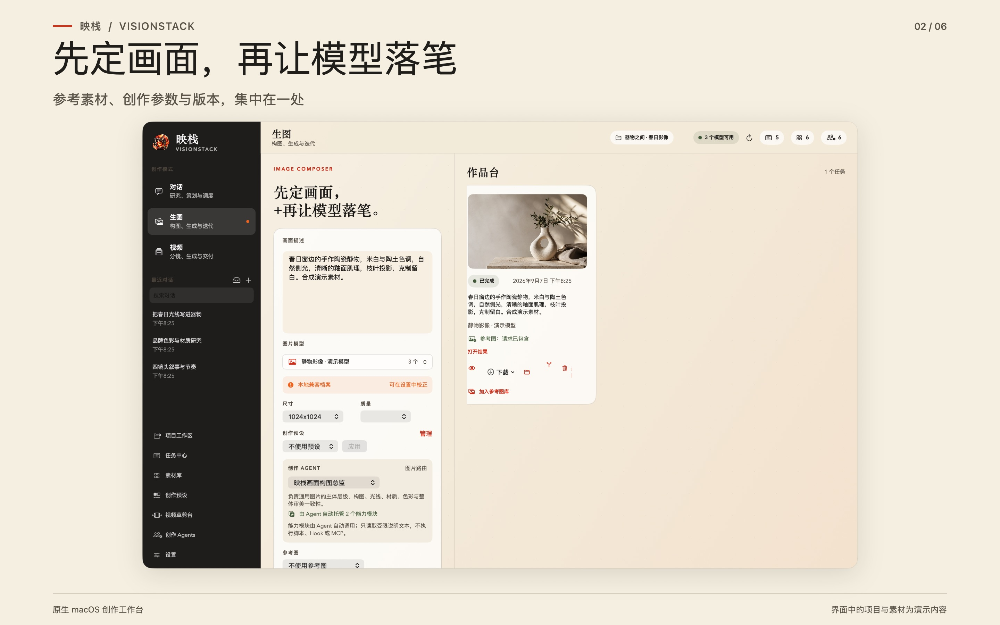
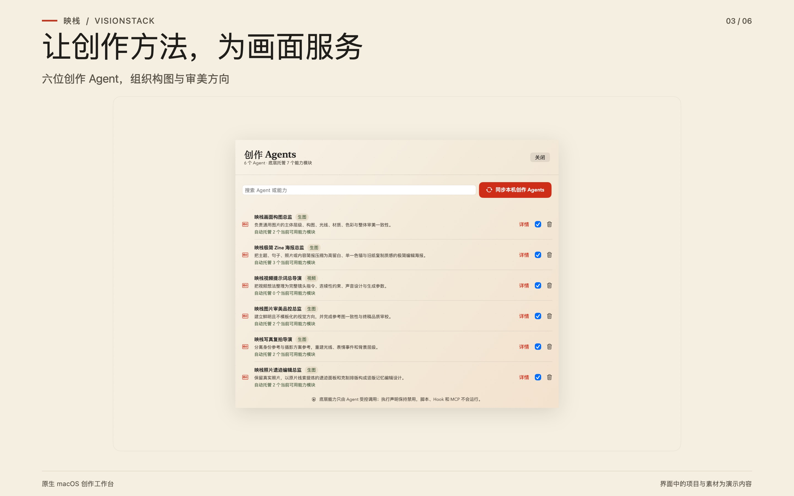
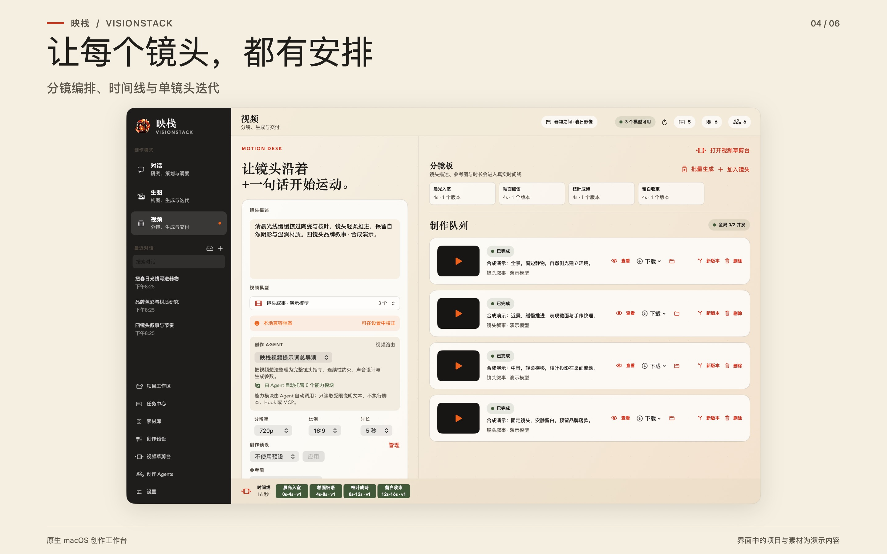
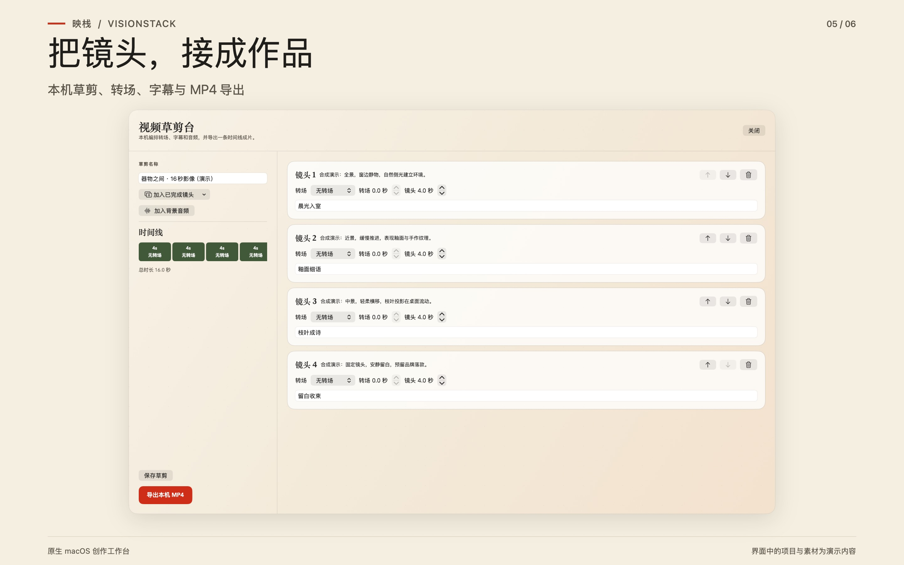
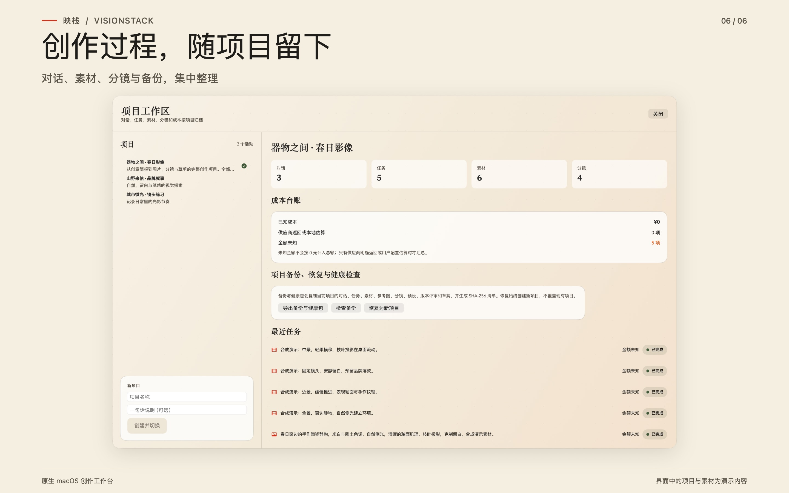

# 映栈 VisionStack

**把灵感从对话推进到图片、分镜和视频。**

映栈是为设计师与内容创作者打造的原生 macOS AI 创作工作台。把对话、参考图、生成任务、素材和版本放进同一个项目，从整理创作方向到完成本机视频草剪，让每一步都有上下文可循。

[下载 macOS 版](https://github.com/dw-zhu-si/VisionStack/releases/download/v0.8.1/VisionStack-0.8.1-macos-arm64.dmg) · [版本说明](https://github.com/dw-zhu-si/VisionStack/releases/tag/v0.8.1) · [产品主页](https://pm.jcm99.com/apple/visionstack/) · [技术支持](https://pm.jcm99.com/apple/visionstack/support.html)



## 下载与平台支持

当前正式版：**0.8.1（build 27）**。

| 平台 | 状态与要求 | 下载 |
| --- | --- | --- |
| macOS · Apple Silicon | 正式版；macOS 14 或更新版本 | [DMG 安装包](https://github.com/dw-zhu-si/VisionStack/releases/download/v0.8.1/VisionStack-0.8.1-macos-arm64.dmg) · [ZIP](https://github.com/dw-zhu-si/VisionStack/releases/download/v0.8.1/VisionStack-0.8.1-macos-arm64.zip) |
| Windows · x64 / ARM64 | 开发中，尚无公开可用版本 | 暂未提供安装包，见下方 Windows 进度 |
| macOS · Intel | 当前未提供 | — |

校验文件：[DMG SHA-256](https://github.com/dw-zhu-si/VisionStack/releases/download/v0.8.1/VisionStack-0.8.1-macos-arm64.dmg.sha256) · [ZIP SHA-256](https://github.com/dw-zhu-si/VisionStack/releases/download/v0.8.1/VisionStack-0.8.1-macos-arm64.zip.sha256)。历史版本保留在 [Releases](https://github.com/dw-zhu-si/VisionStack/releases)。

### Windows 进度

Windows 客户端已建立模型厂商配置、密钥隔离存储和 x64 / ARM64 打包基础。**对话、生图、视频、参考图、创作 Agent、项目与任务等核心创作功能尚未完成。** 内部候选包还没有通过受信任代码签名与真实 Windows 安装、升级、卸载验收，因此目前没有 Windows 下载入口，也不具备与 macOS 版相同的功能。后续可公开版本将单独列出支持范围和安装包；当前未公布发布日期。

## 可以用映栈做什么

| 创作环节 | 已有能力 |
| --- | --- |
| 整理方向 | 在项目内持续对话，梳理需求与提示词，将结果衔接到图片、视频和分镜创作 |
| 探索画面 | 导入参考图、设置模型支持的尺寸与参数，比较多个生成版本，评分并选定最终版 |
| 使用创作 Agent | 借助具名 Agent 梳理构图、光线、色彩与审美方向；内置画面构图、图片品控、极简海报、写真复拍、纸感刊物与照片编辑等方法 |
| 推进分镜 | 编辑镜头、组织批量生成队列、查看预算预览，暂停或恢复本机队列，单独补做镜头 |
| 完成本机草剪 | 编排已有视频素材、转场、字幕和背景音频，导出 MP4 |
| 保存创作过程 | 统一整理项目、素材、参考图、任务、版本与已知费用；导出带 SHA-256 清单的项目备份，恢复为新项目 |

以上为 macOS 版功能。具体生成能力取决于所选模型与接口；暂停本机队列不会撤销服务商已经接收的任务。

## 看看实际界面

以下为 0.8.1 的真实应用界面截图，使用合成演示内容。

### 图片与参考图



### 创作 Agent



### 分镜与生成队列



### 本机视频草剪



### 项目与版本管理



## 快速开始

1. 下载 DMG 及其同名 `.sha256` 文件，放在同一个文件夹。在该文件夹的终端中运行：

   ```sh
   shasum -a 256 -c VisionStack-0.8.1-macos-arm64.dmg.sha256
   ```

2. 打开 DMG，将映栈拖入“应用程序”，然后启动。
3. 在设置中添加兼容的模型服务和自己的连接凭证；也可选用 [ModelHub](https://apps.apple.com/app/id6797847364) 统一管理连接。
4. 创建项目，从对话或参考图开始。确认所选模型支持所需能力，再提交生成任务。

## 模型连接方式

可配置 **OpenAI 兼容、Anthropic 或 Google Gemini** 接口，也可使用可选的 ModelHub 网关。ModelHub 不是必需依赖。

不同接口的对话、图片和视频能力不同。手动登记模型 ID 不会增加模型本身的能力；非标准图片或视频接口需要相应适配，不能因为服务商提供某项功能就假定当前连接一定可用。

## 数据、隐私与费用

- 映栈本身免费，不包含应用内购买；AI 功能需要自行配置可用服务，第三方模型调用可能收费。
- 项目、历史和已下载媒体默认保存在本机 App Sandbox；AI 请求中的提示词、相关上下文和选定参考媒体会发送至你选择的服务。
- 首次发送 AI 请求前会说明第三方数据处理并征求同意，可在设置中撤回后续发送授权。连接凭证保存在 macOS Keychain。
- 联网检索为可选功能；开启后检索词会发送至 DuckDuckGo。费用记录仅反映已获取的信息，实际金额以服务商账单为准。

查看[隐私政策](https://pm.jcm99.com/apple/visionstack/privacy.html)和[使用条款](https://pm.jcm99.com/apple/visionstack/terms.html)。

## 支持与仓库用途

本仓库是映栈的**官方产品介绍与发行包仓库**，不包含应用源码。macOS 正式制品按 Developer ID 签名、Apple 公证、Staple 与 Gatekeeper 流程验证后发布。

使用问题请访问[技术支持](https://pm.jcm99.com/apple/visionstack/support.html)；安全问题请按 [SECURITY.md](SECURITY.md) 私下报告。请使用官方 Release 及对应校验文件，避免第三方重打包副本。第三方组件说明见 [THIRD_PARTY_NOTICES.md](THIRD_PARTY_NOTICES.md)。

Copyright © 2026 野路子工作室。保留所有权利。
