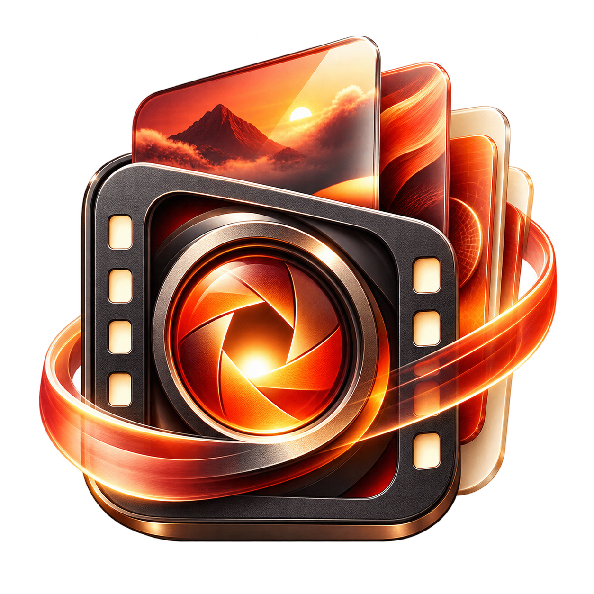

<div align="center">



# 映栈 VisionStack

### 从灵感到成片，让每一步创作留在同一个项目里。

原生 macOS AI 图片与视频创作工作台 · MIT 开源

[](LICENSE)
[](#下载与安装)
[](#从源码构建)
[](https://github.com/dw-zhu-si/VisionStack/releases/tag/v0.8.1)

**[下载 macOS 版](https://github.com/dw-zhu-si/VisionStack/releases/download/v0.8.1/VisionStack-0.8.1-macos-arm64.dmg)** · **[浏览功能](#核心功能)** · **[查看截图](#界面预览)** · **[参与开发](CONTRIBUTING.md)**

[产品主页](https://pm.jcm99.com/apple/visionstack/) · [版本记录](https://github.com/dw-zhu-si/VisionStack/releases) · [技术支持](https://pm.jcm99.com/apple/visionstack/support.html)

</div>

---

## 映栈是什么

映栈面向设计师、视觉创作者与视频创作者，将**对话、参考图、AI 生成、分镜、草剪和项目管理**整合到一个原生桌面应用中。你可以围绕一个主题持续探索画面、比较版本、组织镜头，再将已有素材编排成视频。

从一张参考图、一段想法或一个项目开始，创作过程中的提示词、素材、任务和版本会随项目保留。模型服务由你选择，可直连兼容接口，也可通过可选的 ModelHub 网关接入。

**典型流程：** 整理想法 → 导入参考 → 探索图片 → 编排分镜 → 本机草剪 → 保存作品与项目。

> **当前平台状态：** macOS 正式版可下载；Windows 源码已公开，仍处于配置管理原型阶段，尚无可用的正式安装包。

## 核心功能

| 功能 | 可以完成的工作 |
| :--- | :--- |
| **项目内持续对话** | 整理创作需求、研究方向与提示词，将对话结果衔接到图片、视频和分镜任务。 |
| **参考图与图片创作** | 导入和复用参考图，选择模型支持的尺寸与参数，探索多个版本、评分并选定最终版。 |
| **具名创作 Agent** | 围绕构图、审美品控、极简海报、写真复拍、纸感照片编辑和视频提示词组织创作方法。 |
| **分镜与批量队列** | 编辑镜头、查看预算预览、组织批量生成，暂停或恢复本机队列，单独补做某个镜头。 |
| **本机视频草剪** | 编排已有视频素材，设置转场、字幕与背景音频，导出 MP4。 |
| **项目与资产管理** | 统一保存对话、参考图、素材、任务、版本与已知费用；使用带 SHA-256 清单的备份恢复项目。 |

以上为 macOS 版功能。参考图数量、生成尺寸和图片／视频能力取决于模型与接口支持。暂停本机队列不会撤销服务商已接收的任务。

## 界面预览

以下为 0.8.1 的真实应用界面，使用合成演示内容。点击图片查看原图。

<table>
<tr>
<td width="50%" align="center"><a href="assets/screenshots/01-chat-0.8.1.jpg"></a><br><strong>项目对话</strong><br>围绕创作主题积累上下文</td>
<td width="50%" align="center"><a href="assets/screenshots/02-image-0.8.1.jpg"></a><br><strong>图片与参考图</strong><br>从参考素材推进画面探索</td>
</tr>
<tr>
<td align="center"><a href="assets/screenshots/03-agents-0.8.1.jpg"></a><br><strong>创作 Agent</strong><br>组合构图、光线与审美方法</td>
<td align="center"><a href="assets/screenshots/04-storyboard-0.8.1.jpg"></a><br><strong>分镜与队列</strong><br>按镜头组织生成和补做</td>
</tr>
<tr>
<td align="center"><a href="assets/screenshots/05-roughcut-0.8.1.jpg"></a><br><strong>本机视频草剪</strong><br>编排素材并导出 MP4</td>
<td align="center"><a href="assets/screenshots/06-project-0.8.1.jpg"></a><br><strong>项目与版本</strong><br>让素材与创作记录一起留下</td>
</tr>
</table>

## 下载与安装

**当前正式版：0.8.1（build 27）**

| 平台 | 要求与进度 | 下载 |
| :--- | :--- | :--- |
| **macOS · Apple Silicon** | macOS 14 或更新版本，正式版 | **[DMG 安装包](https://github.com/dw-zhu-si/VisionStack/releases/download/v0.8.1/VisionStack-0.8.1-macos-arm64.dmg)** · [ZIP](https://github.com/dw-zhu-si/VisionStack/releases/download/v0.8.1/VisionStack-0.8.1-macos-arm64.zip) |
| **Windows · x64 / ARM64** | 原型开发中，尚无正式安装包 | [源码与当前范围](windows/README.md) |
| **macOS · Intel** | 当前未提供官方安装包 | — |

校验文件：[DMG SHA-256](https://github.com/dw-zhu-si/VisionStack/releases/download/v0.8.1/VisionStack-0.8.1-macos-arm64.dmg.sha256) · [ZIP SHA-256](https://github.com/dw-zhu-si/VisionStack/releases/download/v0.8.1/VisionStack-0.8.1-macos-arm64.zip.sha256)。其他版本见 [Releases](https://github.com/dw-zhu-si/VisionStack/releases)。

1. 下载 DMG，打开后将映栈拖入“应用程序”。
2. 启动映栈，在设置中添加自己的模型服务和连接凭证。
3. 创建项目，整理想法或导入参考图，选择支持所需能力的模型后开始创作。

<details>
<summary>如何校验下载文件？</summary>

将 DMG 和同名 `.sha256` 文件放在同一个文件夹，在该目录运行：

```sh
shasum -a 256 -c VisionStack-0.8.1-macos-arm64.dmg.sha256
```

输出文件名及 `OK` 表示校验通过。官方 macOS 安装包通过 Developer ID 签名与 Apple 公证流程发布。

</details>

## 连接你自己的模型

| 接入方式 | 说明 |
| :--- | :--- |
| **OpenAI 兼容接口** | 配置兼容服务地址与凭证，具体功能以接口实际支持为准。 |
| **Anthropic / Google Gemini** | 使用对应协议连接，不同协议提供的生成能力不同。 |
| **ModelHub（可选）** | 统一管理多家厂商与路由；非标准图片／视频能力需要网关实际适配。[了解 ModelHub](https://apps.apple.com/app/id6797847364) |

ModelHub 不是必需依赖。手动登记模型 ID 不会增加模型本身或当前接口的能力。

## 从源码构建

### macOS 社区版

需要 macOS 14+，以及支持 **Swift 6.2 或更新版本**的 Xcode 工具链。SwiftPM 工程没有外部包依赖，AppKit / SwiftUI 构建需要 macOS。

```sh
git clone https://github.com/dw-zhu-si/VisionStack.git
cd VisionStack
swift test
./scripts/build_macos.sh
```

输出位于 `dist/community/build.*/VisionStack-community-*.zip`，内含“映栈社区版.app”。无需 Apple 开发者账号；社区构建使用独立的数据目录与凭证命名，默认要求第三方 AI 请求同意。

社区版为本机 ad-hoc 签名构建，未经 Apple 公证。它包含社区构建适配，不保证与官方 0.8.1 二进制逐字节一致。

### Windows 开发版

Windows 使用 **Avalonia / .NET**。在 `windows` 目录使用 `global.json` 约束的 SDK 10.0.302；运行测试还需要可被所用 dotnet 主机发现的 .NET 8 Runtime。

```sh
cd windows
dotnet restore VisionStack.slnx --locked-mode
dotnet build VisionStack.slnx -c Release --no-restore
dotnet test VisionStack.Windows.Tests/VisionStack.Windows.Tests.csproj -c Release --no-build
```

当前 Windows 已实现厂商配置与凭证存储基础；真实模型连接、对话、生图、视频及项目任务流程尚未完成。构建成功不代表已通过真实 Windows 安装与运行验收。

### 项目结构

```text
VisionStack/
├── Sources/VisionStack/   # macOS 应用与内置创作资源
├── Tests/                # Swift 单元测试
├── Packaging/            # 权限、隐私清单与应用元数据
├── windows/              # Windows 原型及测试
├── scripts/              # 社区构建与打包脚本
└── docs/                 # 开发说明
```

完整开发说明见 [DEVELOPMENT.md](docs/DEVELOPMENT.md)。

## 开发进度与贡献

| 方向 | 当前状态 |
| :--- | :--- |
| macOS 图片、视频与项目工作流 | 已提供正式版与源码 |
| 社区本机构建、单元测试与文档 | 已提供 |
| Windows 厂商配置和本地凭证存储 | 已有原型 |
| Windows 核心创作功能 | 待完成 |
| Windows 可信签名与真实设备验收 | 待完成，尚未公布发布日期 |

欢迎提交可复现的问题与改进。贡献前请阅读 [CONTRIBUTING.md](CONTRIBUTING.md)，说明改动目的、平台和验证结果。新增代码或素材需要明确来源与许可，复现材料请使用合成数据。

## 常见问题

<details>
<summary><strong>映栈是否免费？模型调用也免费吗？</strong></summary>

映栈免费且不包含应用内购买。AI 功能需要自行配置模型服务，第三方服务商可能对调用另行收费。费用台账只记录已获取的信息，实际金额以服务商账单为准。

</details>

<details>
<summary><strong>我的项目和素材保存在哪里？</strong></summary>

项目、历史和已下载媒体默认保存在本机。AI 请求中的提示词、相关上下文与选定参考媒体会发送至所选服务。首次请求前会征求同意，可在设置中撤回后续发送授权；macOS 连接凭证保存在 Keychain。

联网检索为可选功能，开启后检索词会发送至 DuckDuckGo。详见[隐私政策](https://pm.jcm99.com/apple/visionstack/privacy.html)。

</details>

<details>
<summary><strong>开源是否意味着 Windows 已经可以日常使用？</strong></summary>

目前公开的是 Windows 配置管理原型，还缺少核心创作流程。Windows 正式安装包需在功能、可信签名与真实 Windows 验收完成后另行发布。

</details>

## 许可证与支持

映栈自有代码、文档与两项基础创作资源按 **[MIT 许可证](LICENSE)** 开源。第三方资源保留各自的许可证与署名，详见 [THIRD_PARTY_NOTICES.md](THIRD_PARTY_NOTICES.md)。软件许可不授予项目名称或商标权利。

[技术支持](https://pm.jcm99.com/apple/visionstack/support.html) · [安全问题报告](SECURITY.md) · [使用条款](https://pm.jcm99.com/apple/visionstack/terms.html)

<div align="center">

由 **野路子工作室**开发与维护 · Copyright © 2026

</div>
